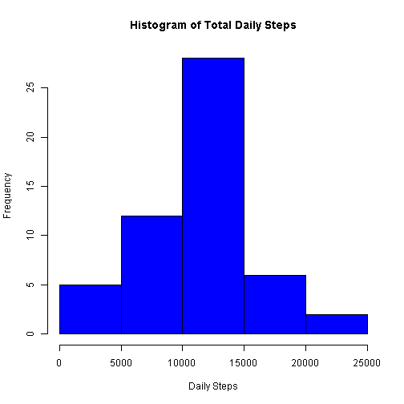
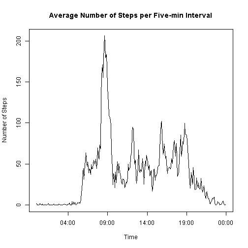
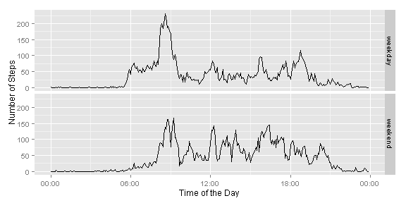

## Loading and preprocessing the data

We will define the variable **activity** to refer to the data given for this assignment. We will create a new column for **activity** named **datetime** referring to the merged date and time of the day. Note that in our dataset, each line refers to a 5-minute interval so naturally, there should be two time values for each intervals.In our newly defined column however, we just used the beginning of the interval so for example, the value in datetime is **2012-10-01 00:00:00**, we are actually referring to the interval *2012-10-01 00:00:00 - 2012-10-01 00:05:00*.

```r
setwd("C://repdata-data-activity")
activity <- read.csv(unz("activity.zip", "activity.csv"))

library(stringr)

datetime <- paste0(substr(strptime(activity$date,format="%Y-%m-%d"),1,10)," ",substr(strptime(paste0(substr(str_pad(activity$interval,4,pad="0"),1,2),":",substr(str_pad(activity$interval,4,pad="0"),3,4)),format="%H:%M"),12,23))
activity$datetime <- strptime(datetime,format="%Y-%m-%d %H:%M:%S")
```

## What is mean total number of steps taken per day?

We can observe that there are NAs in our dataset. We will ignore these values and create a new variable with exactly the same data as our activity variable excluding the lines with NA. We can observe that NAs exists only in **step** column so a more precise description of our new variable is that it contains all lines of **activity** variable except those whose value in **step** column is NA. We will call this new variable as **activitynona**.    
Next we will create a new variable named **dailysteps** which will contain the sum of all steps for each day.


```r
activitynona <- activity[!(is.na(activity$steps)),]
dailysteps <- aggregate(steps~as.factor(date),data=activitynona,sum)
```

Here is a histogram of the total number of steps taken each day.


```r
hist(dailysteps$steps,main="Histogram of Total Daily Steps",xlab="Daily Steps",col="blue")  
```

 

As we can see, on a typical day, the person makes 10,000-15,000 steps. 

Here is the mean and median of the daily steps taken for the period given in our dataset.

```r
mean(dailysteps$steps)
```

```
## [1] 10766.19
```

```r
median(dailysteps$steps)
```

```
## [1] 10765
```

## What is the average daily activity pattern?

Now, we will observe the daily acitivity pattern of the person. We will create a new variable called **fivemin** with three columns, **interval**, **steps** and **TimeInterval**. The new variable  will hold the average number of steps taken for each 5 minute intervals. There are 288 5-minute intervals in a day so there are also 288 lines in this variable. 

```r
fivemin <- aggregate(steps ~ interval,data=activitynona,mean)

fivemin$TimeInterval <- strptime(paste0(substr(str_pad(fivemin$interval,4,pad="0"),1,2),":",substr(str_pad(fivemin$interval,4,pad="0"),3,4)),format="%H:%M")
```

Here is a time series of the 5-minute interval and the average number of steps taken, averaged across all days.

```r
plot(fivemin$TimeInterval,fivemin$steps,type="l",main="Average Number of Steps per Five-min Interval",xlab="Time",ylab="Number of Steps")
```

 

The interval below contains the maximum number of steps of all the 5-minute intervals averaged across all the days in the dataset.

```r
paste0(format(fivemin[which.max(fivemin$steps),3],"%H:%M")," to ",format(fivemin[which.max(fivemin$steps)+1,3],"%H:%M"))
```

```
## [1] "08:35 to 08:40"
```

## Inputing missing values

As we have said earlier, there are NAs in **step** column. Now we will fill the NAs with values. In particular we will use the mean of the number of steps in the 5-minute interval as the new value. 


```r
activitywithna <- activity
l <- length(activity$steps)

for(i in 1:l){
  if(is.na(activity$steps[i])){
    activitywithna$steps[i] = fivemin[which(fivemin$interval == activity$interval[i]) ,2]
  }
}
```

Similarly, we will compute the total steps daily and store it in variable **dailystepswithna**. Then we will plot a  histogram of the daily steps for our new dataset and compute the mean and median.

```r
dailystepswithna <- aggregate(steps~date,data=activitywithna,sum)

hist(dailystepswithna$steps,main="Histogram of Daily Steps",xlab="Number of Daily Steps",col="blue")
```

 

```r
mean(dailystepswithna$steps)
```

```
## [1] 10766.19
```

```r
median(dailystepswithna$steps)
```

```
## [1] 10766.19
```

Our result shows that the mean of the average of total daily steps remained unchanged but the median equaled that of the mean. In this case, we can say that the impact of filling missing values in the dataset is that the two measures of central tendency, mean and median, coincides with each other. 

## Are there differences in activity patterns between weekdays and weekends?
We will still use our dataset with filled NAs for our next steps. We will create a new column called **wday** whose value is either 'weekday' (the date happened to be from Monday-Friday) or 'weekend'. 

```r
activitywithna$wday <- factor(0)
activitywithna$wday = "weekday"

activitywithna[weekdays(activitywithna$datetime) == "Sunday",]$wday = "weekend"
activitywithna[weekdays(activitywithna$datetime) == "Saturday",]$wday = "weekend"
```

Again, we will average the number of steps for each 5-minute interval.

```r
library("ggplot2")
library("scales")
fiveminwithna <- aggregate(steps ~ interval + wday,data=activitywithna,mean)

fiveminwithna$TimeInterval <- strptime(paste0(substr(str_pad(fiveminwithna$interval,4,pad="0"),1,2),":",substr(str_pad(fiveminwithna$interval,4,pad="0"),3,4)),format="%H:%M",tz="GMT")
```
Here is a time-series comparing the number of steps taken per 5-minute interval for weekdays and weekends.

```r
g <- ggplot(fiveminwithna,aes(TimeInterval,steps))
g <- g + geom_line()
g <- g + scale_x_datetime(label=date_format("%H:%M"))
g <- g + xlab("Time of the Day")
g <- g + ylab("Number of Steps")
g <- g + facet_grid(wday~.)
g
```

 

We can see a slight similarity in general pattern of activites between weekdays and weekends but with some differences. We can observe that the person is generally more active the whole day during weekends. However, during weekdays, the person is more active at earlier time in the morning
and peaked at a higher number.
